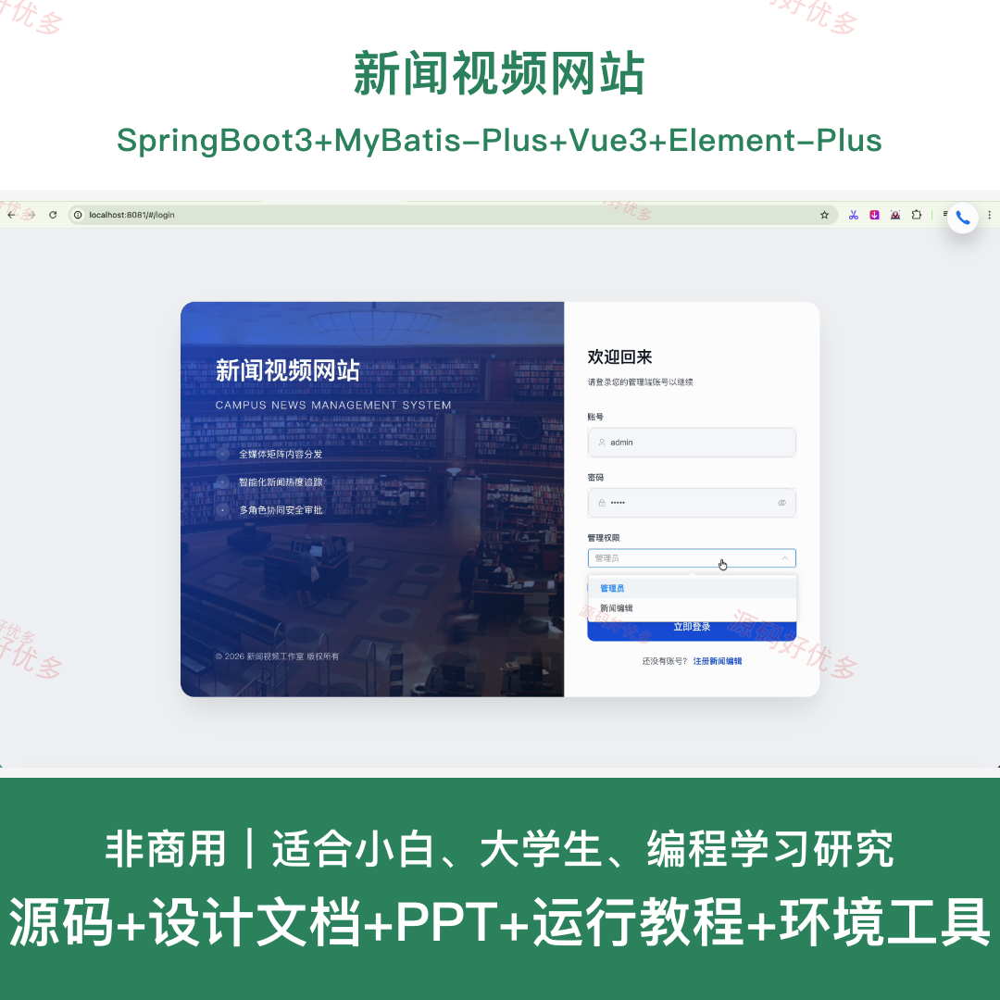
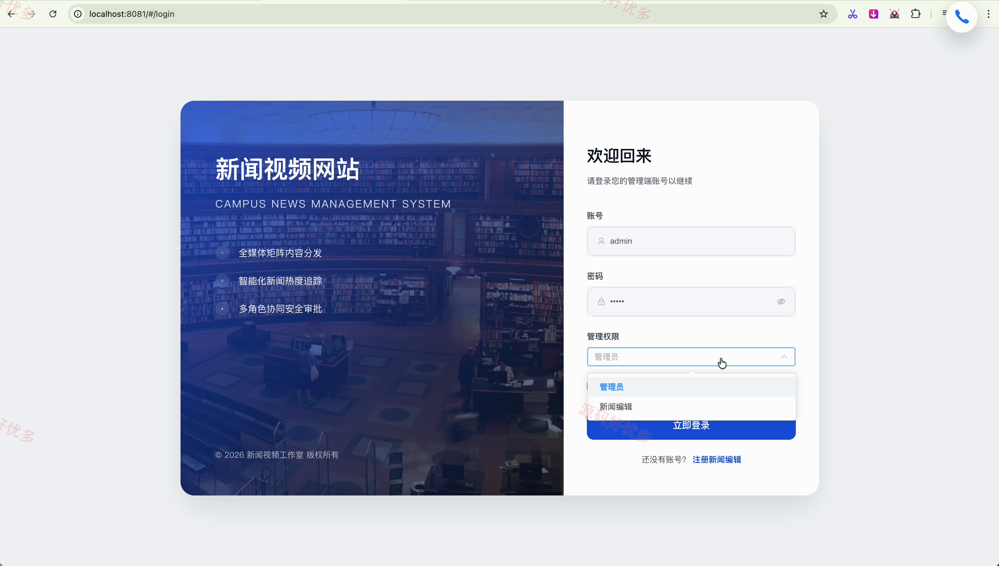
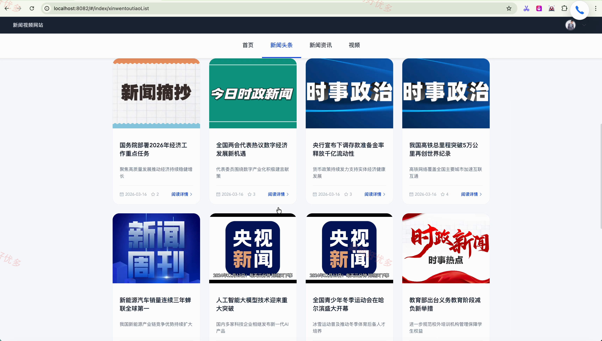
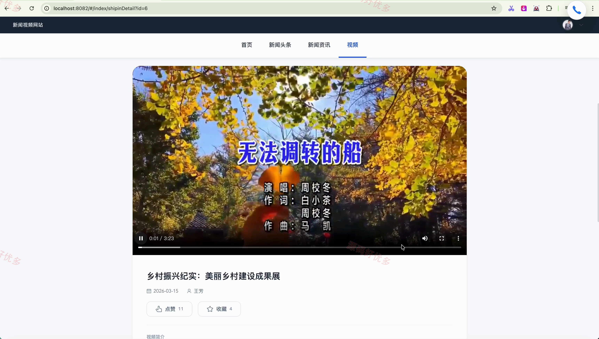
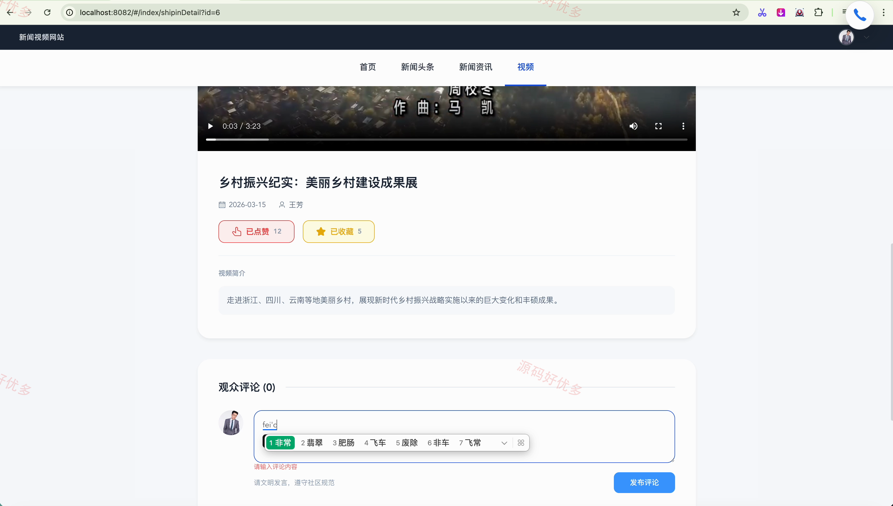
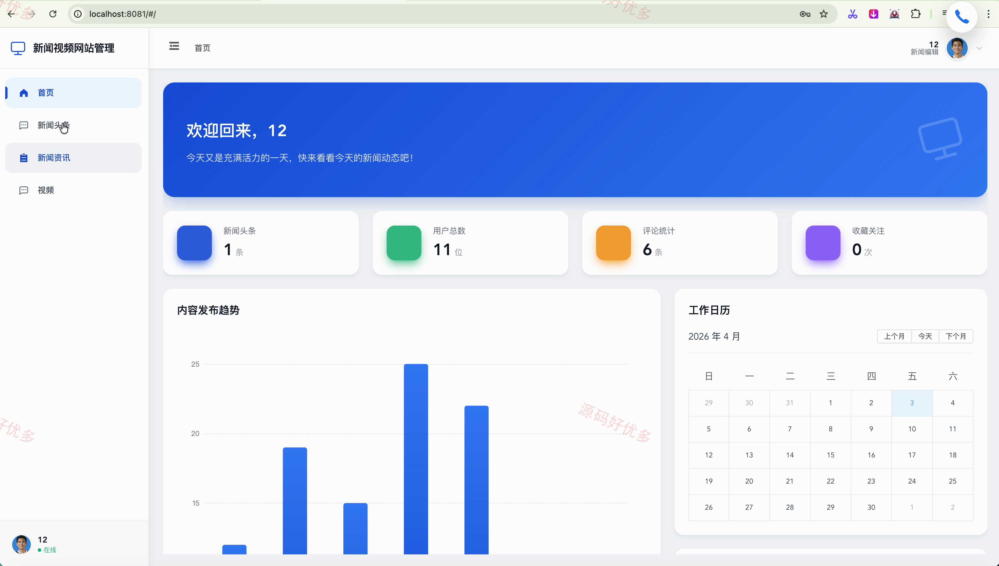
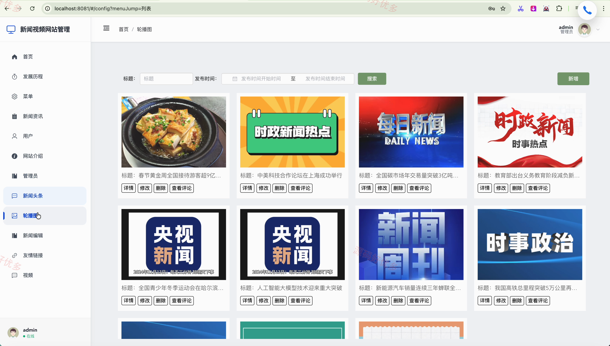
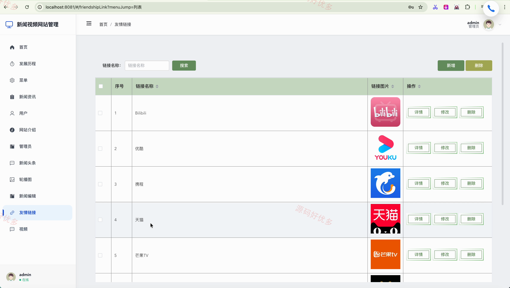
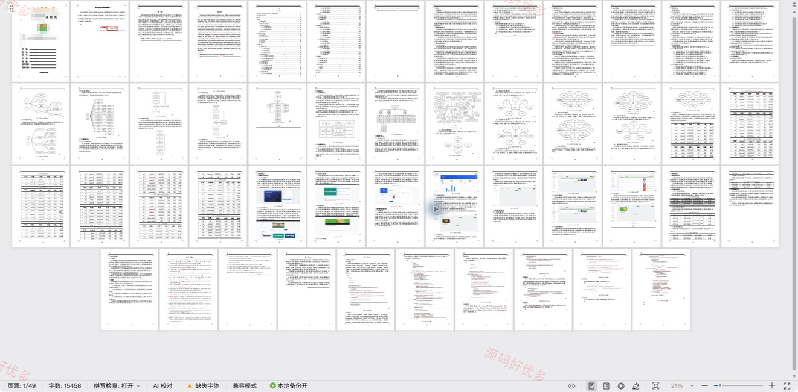

## 源码问题查看主页咨询

### 一、关键词
新闻视频网站、新闻视频网站信息管理、新闻视频网站后台管理

### 二、作品包含
源码+数据库+设计文档+PPT+全套环境和工具资源+本地部署教程

### 三、项目技术
前端技术： Html、Css、Js、Vue3.2、Element-Plus
后端技术：Java、SpringBoot3.3.0、MyBatis-Plus

### 四、运行环境（以下版本亲测，其他版本兼容性请自行测试）
开发工具：IDEA/eclipse + VSCODE

数据库：MySQL8.0+（共16张表）

数据库管理工具：Navicat10以上版本

环境配置软件： JDK17 + Maven3.6.3

前端Nodejs：16+

浏览器：谷歌浏览器

### 五、项目介绍
项目编号：springbootA661D

新闻视频网站面向管理员、用户、新闻编辑，提供发展历程管理、新闻资讯管理、网站介绍管理、管理员管理、新闻头条管理、轮播图管理、新闻编辑管理等功能，实现各角色在系统中的实际业务协作。

角色：管理员、用户、新闻编辑

管理员功能：后台登录、发展历程与网站介绍管理、菜单与轮播图配置、新闻资讯与头条管理、视频与评论管理、用户与新闻编辑管理、友情链接管理、管理员账号管理。

用户功能：前台登录与注册、新闻头条浏览互动、新闻资讯浏览互动、视频浏览与互动、我的收藏管理、个人中心维护。

新闻编辑功能：后台登录与注册、新闻头条内容管理、新闻资讯内容管理、视频内容管理。

### 六、运行截图

